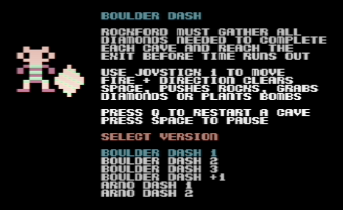
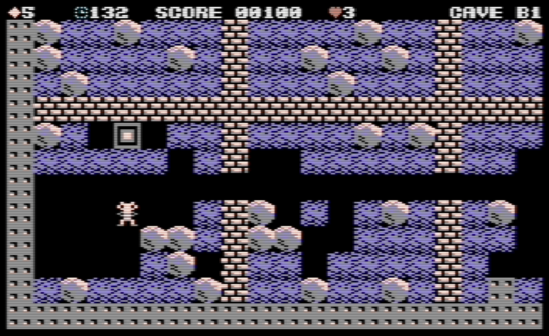
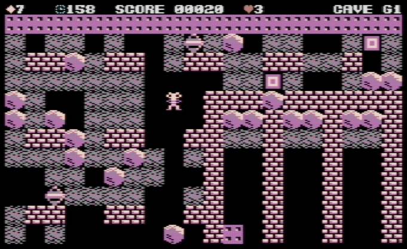
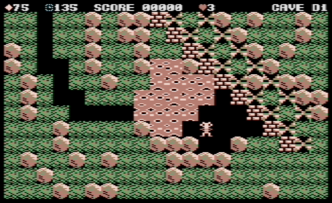
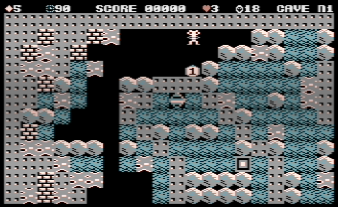
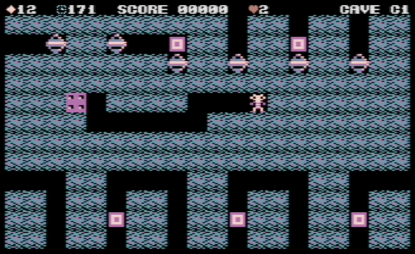
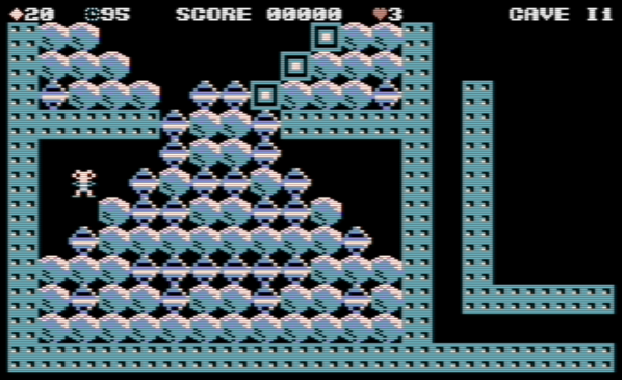

# Boulder Dash for the Commodore 16 (C16) and Plus/4
This is a fan-developed version of Boulder Dash for the standard 16K C16 and the Plus/4. A RAM expansion is not needed for the C16 to play this game.

I recently ported the BBC/Acorn Electron version of Boulder Dash to the Vic20 so thought I'd try doing the same with the C16.

This repo really contains 6 different versions of the game. They all run with the same 'game engine' but have different caves. Use the joystick to select the version from the first menu screen, then press fire to confirm.

- Boulder Dash, Boulder Dash 2 and Boulder Dash 3, are similar to the original games released for other platforms in the 1980's.

- Boulder Dash +1 contains two main enhancements not in the other versions, the use of bombs and having zero-gravity caves.

- The Arno Dash games are some examples of the many fan-developed caves found on [Arno's Boulder Dash fansite](https://www.boulder-dash.nl/). Boulder Dash format files (BDCFF) are used to create new caves which run with the game-engine. They have been adapted slightly for the C16.

## Emulation
[C16 Boulder Dash](./d64/C16%20Boulder%20Dash.d64) is available in the d64 folder.

It has been tested using the VICE emulator (PAL and NTSC) and on a real C16 (PAL) with a joystick connected in port 1.

There are some differences in this C16 version of the game.
- The status bar is different as it shows the diamonds needed, reduced each time one is gathered. The diamond value is not shown. A count of the number of bombs available is included, as are the normal things such as time remaining, lives available and the player score.
- Different versions of Boulder Dash are selectable and all caves except the intermissions are selectable from the menu.
- Bombs and zero-gravity enhancements. These are only used in caves where they have been defined as cave parameters (see below for more details).

## Developer notes

### Build and run
The main program is `main.asm`. It includes other programs such as `spr.asm`, `vars.asm` and others which have been split out from the main program for development convenience.

`bd_build_all.bat` compiles the main program into a PRG file using `acme.exe`. It creates the cave PRG files for each version from the individual cave binary files previously generated from BDCFFs using `BDcavegen.py`. Then all PRG files including the compiled basic loader `bdload` are added into a D64 file using `create_d64.py`.

`bd_run.bat` loads the D64 file using the VICE emulator. The basic command `RUN` starts the game.

## Caves
- All 20 caves are available in memory (16 standard and 4 bonus caves). They each have the same size, 48 bytes used for parameters, 400 bytes for the map. Each tile in the map is a nibble (each byte represents two tiles). When a particular cave is about to be played, it is loaded into a section of memory labelled `cave_parameter_data`. See `cavedata.asm` for more details about the parameters available. 
- New cave files can be converted from BDCFF files found on [Arno's Boulder Dash fansite](https://www.boulder-dash.nl/) using a conversion utility `BDCavegen.py`.

## Acknowledgements
The following sources have all helped to make this development possible and is gratefully acknowledged.
- The Programmer's Reference Guide for the Commodore Plus/4 and C16/Plus4 Reference Book help explain how things are done on the C16.
- The [Plus/4 world website](https://plus4world.powweb.com/plus4encyclopedia) includes helpful reference material.
- The [Demo Maker G font](https://home-2002.code-cop.org/c64/font_05.html) was used for letters, numbers and symbols.
- The [disassembly of the original BBC/Acorn Electron game](https://github.com/TobyLobster/Boulderdash) by TobyLobster was where this all started.
- [Arno's Boulder Dash fansite](https://www.boulder-dash.nl/) provided was the source of the BDCFF files used to create the caves. The Arno version 1 caves feature in this game, although there are many others available!